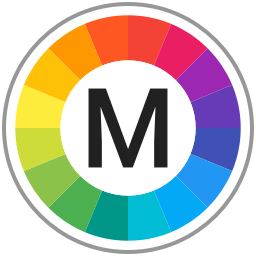

<p align="center">
	
</p>
<p align="center">
	
</p>

<p align="center">
	<a href="https://github.com/johnyanarella/MaterialDesignColorPicker/releases"></a>
	<a href="https://developer.apple.com/swift/"></a>
	<a href="LICENSE"></a>
	<a href="http://www.apple.com/macos"></a>
</p>

<p align="center">
	
</p>

## About

Material Design Color Picker is a custom color picker plugin for macOS that allows users to navigate color swatches and select colors from Google's [Material Design Color Palette](https://material.io/guidelines/style/color.html).


Once installed, the color picker is available systemwide within any macOS application that utilizes the standard color panel (aka NSColorPanel) for color selection, including:

* [Acorn 4.5+](http://www.flyingmeat.com/acorn/)
* [Pixelmator 3.4+](http://www.pixelmator.com/mac/)
* [iWork](http://www.apple.com/iwork/)
	* Keynote
	* Pages
	* Numbers
* macOS System Apps
	* Mail
	* Preview
	* TextEdit
* and many other third-party macOS applications.

**Requires macOS 10.13 (or higher).**

## Installation

Download the latest signed release build from the [releases](https://github.com/CodeCatalyst/MaterialDesignColorPicker/releases) page on GitHub.

Expand the .zip file and copy the extracted `MaterialDesignColorPicker.colorPicker` file to the folder:

```
~/Library/ColorPickers/
```

**Tip:** You can open this folder quickly by selecting the "Go" | "Go to Folder..." (⇧⌘G) menu in Finder and typing in the path above.

## Building from Source Code

Build the `MaterialDesignColorPicker` target and copy the resulting `MaterialDesignColorPicker.colorPicker` bundle to:

```
~/Library/ColorPickers/
```

The project workspace also includes an Xcode Playground which can be used in combination with the `MaterialDesignColorPickerFramework` target for rapid iterative experimentation during development.

**Requires Xcode 11 (or higher) and macOS X 10.13 (or higher).**

## Contributors

* [John Yanarella](http://twitter.com/johnyanarella) (Creator)

## Acknowledgements

* Special thanks to:
	* [Maciek Grzybowski](http://www.n-created.com/) whose [article](http://macoscope.com/blog/how-to-extend-the-os-x-color-panel-with-a-custom-color-picker/) on custom color picker development was invaluable
	* [Matt Braun](http://www.magnateinteractive.com/) for beta testing and feedback
	* [Kevin Kazmeirczak](http://www.kevinkaz.com/) for beta testing and feedback

## License

Copyright &copy; 2017-2020 John Yanarella

Permission is hereby granted, free of charge, to any person obtaining a copy of this software and associated documentation files (the "Software"), to deal in the Software without restriction, including without limitation the rights to use, copy, modify, merge, publish, distribute, sublicense, and/or sell copies of the Software, and to permit persons to whom the Software is furnished to do so, subject to the following conditions:

The above copyright notice and this permission notice shall be included in all copies or substantial portions of the Software.

THE SOFTWARE IS PROVIDED "AS IS", WITHOUT WARRANTY OF ANY KIND, EXPRESS OR IMPLIED, INCLUDING BUT NOT LIMITED TO THE WARRANTIES OF MERCHANTABILITY, FITNESS FOR A PARTICULAR PURPOSE AND NONINFRINGEMENT. IN NO EVENT SHALL THE AUTHORS OR COPYRIGHT HOLDERS BE LIABLE FOR ANY CLAIM, DAMAGES OR OTHER LIABILITY, WHETHER IN AN ACTION OF CONTRACT, TORT OR OTHERWISE, ARISING FROM, OUT OF OR IN CONNECTION WITH THE SOFTWARE OR THE USE OR OTHER DEALINGS IN THE SOFTWARE.
